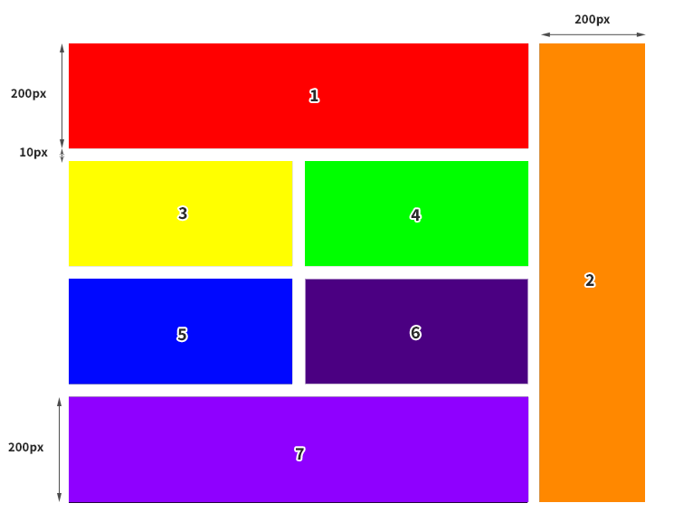

# Zadanie 1
(1pkt)

Stwórzcie podstawowy reset CSS scss/partials/_zadanie01.scss

# Zadanie 2 

(2 pkt)

Zdefiniujcie za pomocą Sass mapę o nazwie rainbow, która będzie miała w sobie 7 par klucz-wartość, a każda wartość odpowiada innemu kolorowi tęczy. 

Użyjcie kolorów podanych poniżej (ważne - niech nazwy kolorów i wartości będą dokładnie takie jak w przykładzie poniżej):

- red: #FF0000
- orange: #FF7F00
- yellow: #FFFF00
- green: #00FF00
- blue: #0000FF
- indigo: #4B0082
- violet: #8F00FF

# Zadanie 3

(3 pkt)

Za pomocą pętli sass wygenerujcie zbiór klas **.color-1**, **.color-2** itp. 

Każda klasa powinna nadawać elementowi tło o kolejnym kolorze pobranym z mapy z zadania 2.

Dla przykładu .color-1 nada tło koloru #FF0000, a klasa .color-2 nada kolor #FF7F00.

# Zadanie 4

(2 pkt)

Ustawcie wysokości wszystkich sekcji:
- Elementy o klasie **section-1** oraz **section-3** powinny mieć 1000px wysokości i całą dostępną szerokość,
- Element o klasie **section-2** powinien zajmować całą wysokość i całą szerokość okna przeglądarki.

Uwaga! nie powinien pojawiać się pasek przewijania.

# Zadanie 5

(5 pkt)

W sekcji o klasie **section-1** za pomocą grida utwórzcie siatkę jak na załączonym obrazku poniżej.

Wewnątrz siatki powinny się znaleźć 7 elementów, które będą miały kolejne kolory dodane za pomocą klas z zadania 3. 

Siatka powinna zajmować całą powierzchnię section-1 (element yellow, green, blue i indigo powinny dopasować swój rozmiar).

Uwaga! Numery na siatce są tylko pomocą. Nie musimy ich odtwarzać.

# Zadanie 6

(3 pkt)

Napiszcie mixin o nazwie addColor, który przyjmuje jeden parametr - kolor. 

Po wywołaniu mixin dodaje do elementu dwie rzeczy: kolor podany jako parametr ustawia jako background-color oraz dodaje do elementu pseudoklasę hover taką, że po najechaniu myszką, kolor tła staje sie jaśniejszy o 50%. 

Wywołajcie ten mixin wewnątrz elementu o klasie section-2 używając koloru #000000 jako parametru.

# Zadanie 7

(4 pkt)

W sekcji o klasie section-3 znajduje się obrazek. 
Ustawcie tej sekcji 1000px wysokości (jeśli nie zostało to zrobione w Zadaniu 4). 

Następnie opiszcie odpowiednie warunki tak aby:

- Gdy ekran ma 1025px szerokości lub więcej obraz miał 600px szerokości i był idealnie na środku sekcji (w pionie i poziomie),
- Gdy ekran ma między 768px a 1024px szerokości (włączając w to wymienione wartości) to obrazek miał 200px szerokości i był w prawym górnym rogu sekcji,
- Gdy ekran ma 767px szerokości lub mniej to obrazek ma całą dostępną szerokość sekcji.

Pamiętajcie, aby obrazek zawsze miał zachowane proporcje (nie może być rozciągnięty w pionie lub w poziomie)!

